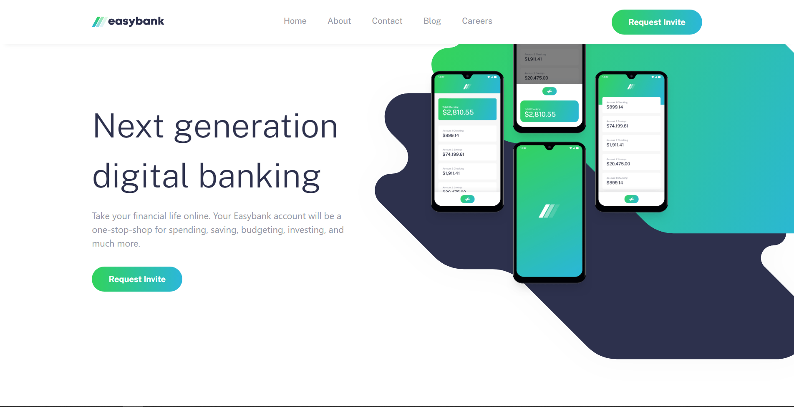

# Frontend Mentor - Easybank landing page solution

This is a solution to the [Easybank landing page challenge on Frontend Mentor](https://www.frontendmentor.io/challenges/easybank-landing-page-WaUhkoDN). Frontend Mentor challenges help you improve your coding skills by building realistic projects. 

## Table of contents

- [Overview](#overview)
  - [The challenge](#the-challenge)
  - [Screenshot](#screenshot)
  - [Links](#links)
- [My process](#my-process)
  - [Built with](#built-with)
  - [What I learned](#what-i-learned)
  - [Useful resources](#useful-resources)
- [Author](#author)

## Overview

### The challenge

Users should be able to:

- View the optimal layout for the site depending on their device's screen size
- See hover states for all interactive elements on the page

### Screenshot

### Links

- [FrontendMentor Solution](https://www.frontendmentor.io/solutions/easybank-landing-page-R1udk3DYcM)
- [Live Site](https://bt-easybank-landing-page.netlify.app/)

## My process

### Built with

- Flexbox
- CSS Grid
- Mobile-first workflow
- [React](https://reactjs.org/) - JS library
- [Tailwind](https://tailwindcss.com/) - CSS framework
- [Styled Components](https://styled-components.com/)
- [Sass](https://sass-lang.com/) - CSS pre-processor
- [Vite](https://vitejs.dev/) - Project management

### What I learned

Since this is my first React project, I've learned a lot about its essentials, file and folder structure, functional components and their reusability etc. It was also my first time using TailwindCSS, so I've learned a lot about it, and I can say I will use it again.

### Useful resources

- [React Hamburger Icon](https://hamburger-react.netlify.app/)
- [JavaScript Mastery on Youtube](https://www.youtube.com/@javascriptmastery) - This guy's tutorials taught me everything about React. [This video](https://www.youtube.com/watch?v=F627pKNUCVQ) specifically.

## Author

- [Frontend Mentor](https://www.frontendmentor.io/profile/boristenkes)
